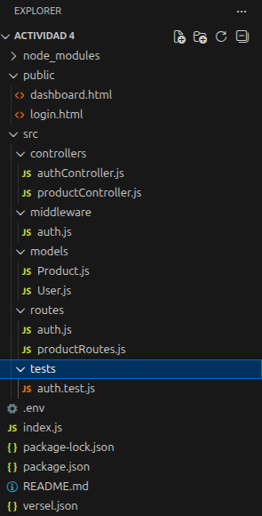
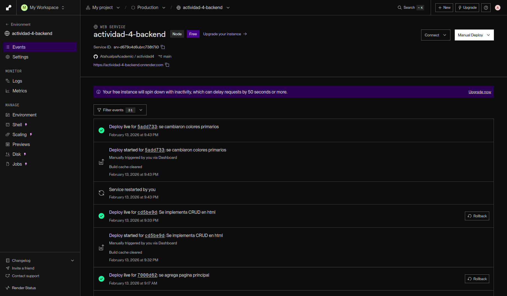
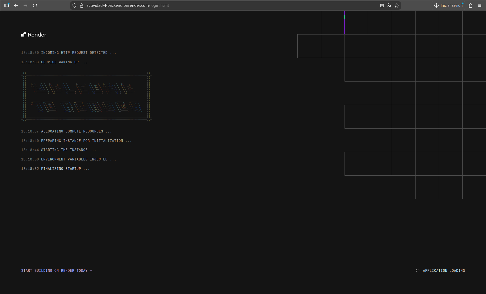
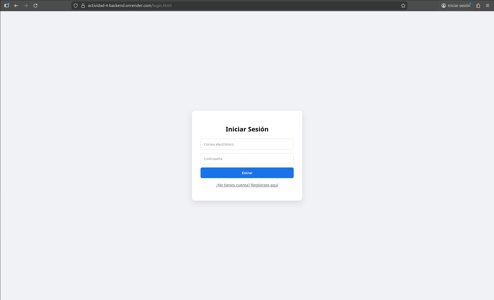
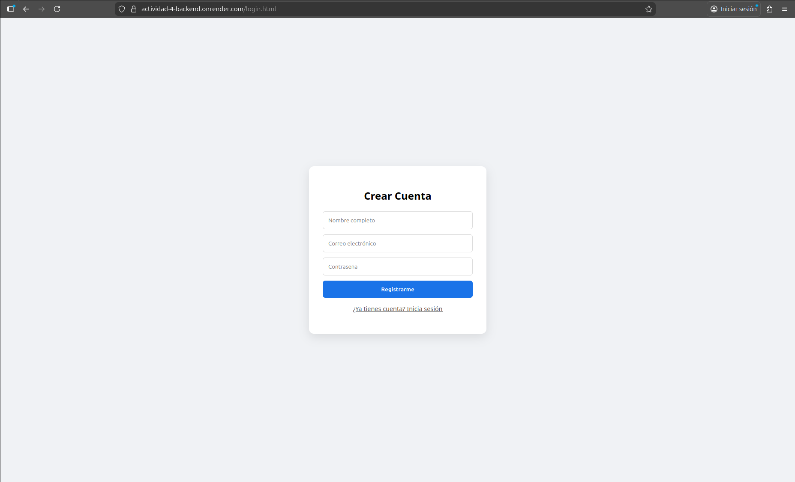
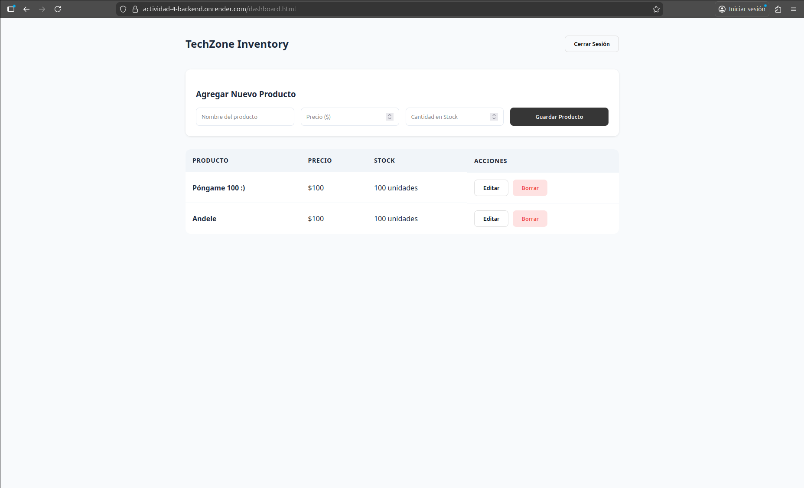
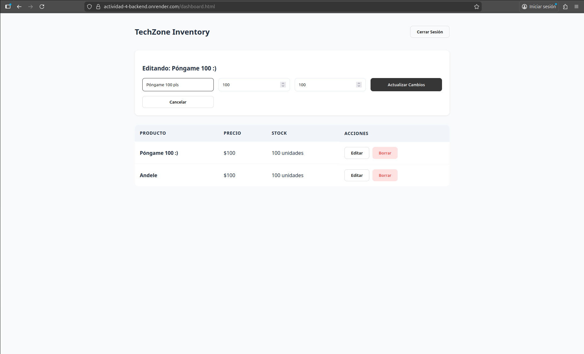
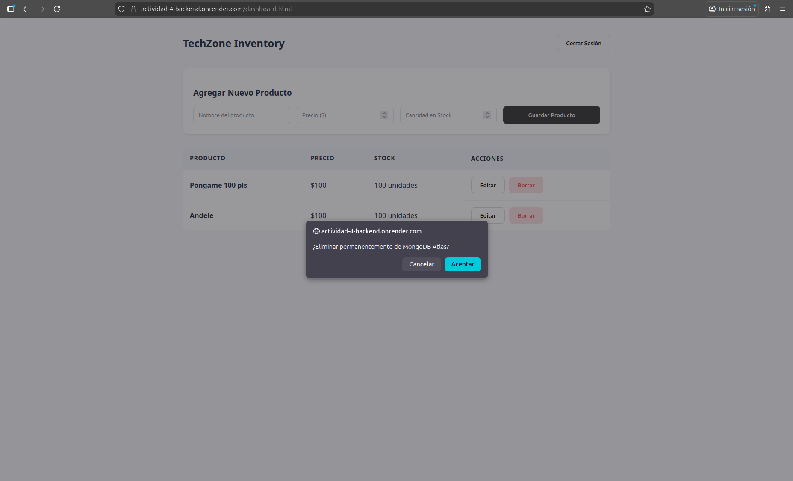
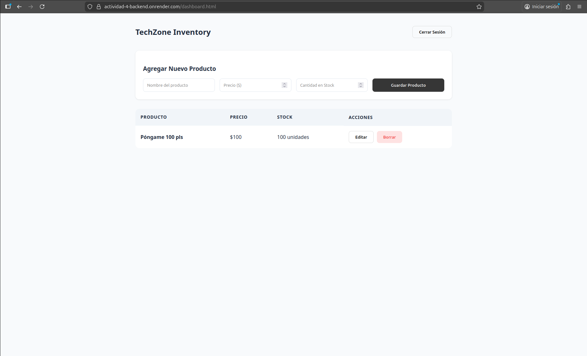

# Product Managment API & Dashboard

Este proyecto es una solución integral para la gestión de inventarios, que implementa una arquitectura RESTful, seguridad mediante JWT y un despliegue automatizado en la nube. Desarrollado como parte del 4to semestre de la carrera de Ingeniería en Desarrollo de Software.

## Stack Tecnológico

* Entorno de Ejecución: Node.js con Express.
* Base de Datos: MongoDB ATlas (Cluster NoSQL en la nube). 
* Seguridad: Autenticación con JSON Web Tokens (JWT) y hashing de contraseñas con Bcryptjs.
* Infraestructura (SaaS): Despliegue en Render con integración continua (CI/CD) desde GitHub.
* Pruebas: Testing de seguridad con Jest y SUpertest.

## Requerimientos del Sistema

### Funcionales (RF)
* RF1 - Autenticación: Registro e inicio de sesión con validación de credenciales.
* RF2 - Seguridad: Generación de tokens de acceso para proteger rutas privadas.
* RF3 - CRUD de Productos: Gestión completa de inventario (Crear, Leer, Actualizar, Eliminar).

### No Funcionales (RNF)

* RNF1 - Persistencia: Almacenamiento de datos en tiempo real en la nube.
* RNF2 - Disponibilidad: Despliegue en plataforma SaaS para acceso público 24/7.
* RNF3 - UX/UI: Interfaz minimalista diseñada para la eficiencia operativa.

## Estructura del proyecto

## Configuración e Instalación 

1. Variables de Entorno (.env)

El sistema requiere las siguientes llaves para operar:
* MONGO_URI: Cadena de conexión de MongoDB Atlas.
* JWT_SECRET: Llave privada para la firma de tokens.

2. Comandos Local (Terminal Linux)

* npm install (Instalar dependencias)
* npm start (Iniciar servidor de desarrollo)

## Conclusión

El desarrollo de esta plataforma permitió consolidar el ciclo completo de una aplicación profesional, integrando seguridad, persistencia y despliegue automatizado. Se validó la eficacia de JWT y Bcryptjs como estándares para la protección de identidades, así como el uso de MongoDB Atlas para garantizar una persistencia de datos escalable en la nube.

Asimismo, el despliegue en Render demostró la importancia de las metodologías CI/CD, permitiendo que la aplicación pase del desarrollo local a un entorno de producción accesible de forma inmediata. La resolución de conflictos de red y rutas durante el proceso fortaleció mi capacidad de diagnóstico técnico, resultando en un sistema robusto que cumple con los requerimientos de la ingeniería moderna.

## Links

* Repositorio GitHub: https://github.com/AtahualpaAcademic/actividad4
* Aplicación en Vivo (Render): https://actividad-4-backend.onrender.com/login.html

### Nota
Se implementó una configuración de acceso de red 0.0.0.0/0 en MongoDB Atlas para garantizar la comunicación con las direcciones IP dinámicas de Render, asegurando la estabilidad del servicio en producción.

## Render

## Página HTML con CRUD

Gracias por su atención.